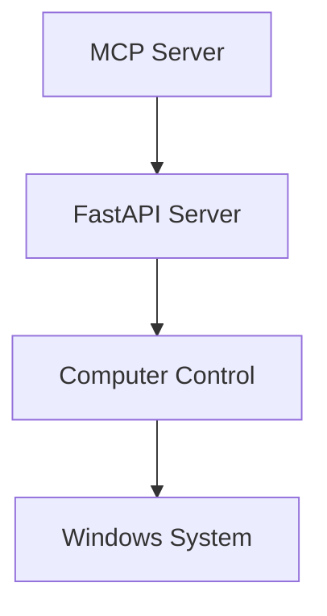

# Windows Control MCP Server

A powerful Model Context Protocol (MCP) server that enables Claude to control Windows through a secure API interface while viewing live desktop feedback. This project implements a three-layer architecture for reliable and safe system control.

## Architecture Overview



The system consists of three main layers:
1. **MCP Server Layer** (TypeScript) - Handles Claude interaction and command processing
2. **API Layer** (Python/FastAPI) - Provides RESTful endpoints for system control
3. **Computer Control Layer** (Python) - Manages low-level Windows operations

## Features

### System Control
- **Mouse Operations**
  - Precise cursor movement
  - Single/double clicks (left, right, middle buttons)
  - Drag operations
  - Position tracking

- **Keyboard Input**
  - Text typing with configurable delays
  - Special key handling
  - Key combinations (Ctrl, Alt, Shift modifiers)
  - International character support

- **Screen Operations**
  - Real-time screenshot capture
  - Screen dimension detection
  - Image processing and optimization
  - Base64 encoding for transmission

- **Window Management**
  - Window focus control
  - State management (minimize, maximize, restore)
  - Smart coordinate scaling
  - Boundary protection

## Prerequisites

- Node.js 18 or higher
- Python 3.8 or higher
- Windows 10 or higher

## Installation

1. **Install Python Dependencies**
```bash
pip install -r requirements.txt
```

2. **Install Node.js Dependencies**
```bash
npm install
```

3. **Build the MCP Server**
```bash
npm run build
```

## Configuration

### Claude Desktop Integration

1. Start the Python API server:
```bash
python main.py
```

2. Configure Claude Desktop by adding to `%APPDATA%\Claude\claude_desktop_config.json`:
```json
{
  "mcpServers": {
    "windows-control": {
      "command": "C:\\Program Files\\nodejs\\node.exe",
      "args": [
        "C:\\Users\\YourUsername\\path\\to\\windows-implementation\\dist\\index.js",
        "--api-url=http://localhost:8000"
      ],
      "cwd": "C:\\Users\\YourUsername\\path\\to\\windows-implementation"
    }
  }
}
```

### Configuration Options

- **API Settings**
  - `--api-url`: API server URL (default: http://localhost:8000)

- **Performance Settings**
  - Mouse movement duration
  - Click delays
  - Keyboard input timing
  - Screenshot quality

## Security Features

1. **Input Validation**
- Strict coordinate boundary checking
- Key mapping validation
- Screenshot size limits

2. **Safety Measures**
- PyAutoGUI failsafe mechanism
- Screen boundary protection
- Controlled input delays
- Resource management

3. **Error Handling**
- Comprehensive exception handling
- Detailed logging
- Automatic recovery mechanisms

## Development

### Running in Development Mode

```bash
npm run dev
```

### Custom API Configuration

```bash
npm start -- --api-url=http://localhost:8000
```

## API Documentation

### Mouse Control Endpoints

- `POST /mouse/move`
  - Move cursor to coordinates
  - Parameters: `x`, `y`

- `POST /mouse/click`
  - Click at current position
  - Optional: `button` ("left", "right", "middle")

- `POST /mouse/double-click`
  - Double click at position
  - Optional: `x`, `y`

### Keyboard Control Endpoints

- `POST /keyboard/type`
  - Type text
  - Parameter: `text`

- `POST /keyboard/press`
  - Press specific key
  - Parameter: `key`
  - Optional: `ctrl`, `alt`, `shift`

### Screen Operation Endpoints

- `GET /screenshot`
  - Capture screen
  - Returns base64 encoded JPEG

- `GET /screen/size`
  - Get screen dimensions

## Technical Details

### Stack Components

- **Frontend/MCP**
  - TypeScript
  - Model Context Protocol SDK
  - Axios

- **Backend/API**
  - Python 3.8+
  - FastAPI
  - Uvicorn
  - Pydantic

- **System Integration**
  - PyAutoGUI
  - Win32GUI
  - OpenCV
  - PIL
  - NumPy

## Error Handling

The system implements a layered error handling approach:

1. **MCP Server Level**
- Request validation
- Response formatting
- Connection management

2. **API Level**
- Endpoint validation
- Request parsing
- Response standardization

3. **System Level**
- Operation validation
- Resource management
- Recovery procedures

## Performance Optimization

- Efficient screenshot compression
- Smart coordinate scaling
- Controlled input delays
- Memory-efficient image handling
- Proper resource cleanup

## Contributing

1. Fork the repository
2. Create a feature branch
3. Commit your changes
4. Push to the branch
5. Create a Pull Request

## License

This project is licensed under the MIT License - see the LICENSE file for details.
